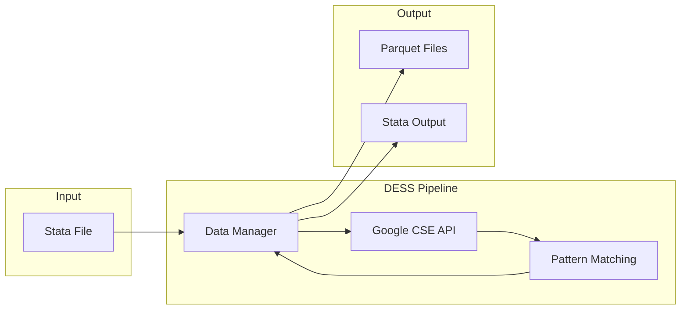
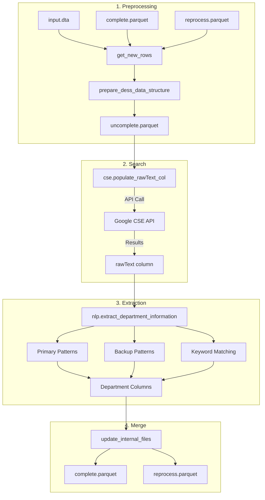

# DESS: Department Extraction using Search and spaCy

DESS is an automated data pipeline designed to extract faculty department information from university faculty databases. The system processes faculty names and universities to populate missing department information through web search and natural language processing.

## Overview

The pipeline takes a Stata file containing faculty names and their respective universities, searches for each faculty member using Google's Custom Search API, then extracts department information using pattern matching and keyword classification.



## Project Structure

```
DESS/
├── README.md                    # This file
├── cse.py                       # Google Custom Search API client
├── google_api_workflow.py       # Automated end-to-end workflow
├── data_pipeline_manager.py     # Data flow and file management
├── workflow.ipynb               # Interactive workflow notebook
├── stata_conversion.py          # Stata format utilities
├── dropbox_auth.py              # Dropbox OAuth setup utility
├── dess/                        # Core modules
│   ├── nlp.py                   # Department extraction logic
│   ├── stats.py                 # Progress tracking utilities
│   └── search.py                # (Archived) Selenium scraper
├── llm-batch-experiment/        # (Archived) LLM-based extraction experiment
├── rmp-experiment/              # Rate My Professor API integration
├── requirements.txt             # Python dependencies
└── .env                         # Environment configuration
```

## Architecture

### Data Flow



### Department Extraction Logic

The NLP module uses a two-tier extraction approach:

1. **Regex Pattern Matching**: Primary patterns identify explicit department mentions (e.g., "professor in the department of Economics"). Backup patterns capture contextual mentions (e.g., "research focused on Biology").

2. **Keyword Whitelist Matching**: Extracted terms are matched against a curated whitelist of department names with precision levels (1-3), where lower numbers indicate higher confidence.

**Output columns:**
- `isProfessor`, `isInstructor`, `isEmeritus` - Faculty classification flags
- `isAssistantProf`, `isAssociateProf`, `isFullProf` - Rank indicators
- `department_textual` - Raw extracted department text
- `department_keyword` - Matched whitelist keyword
- `keyword_precision` - Confidence level (1-3)

## Quick Start

### Prerequisites

- Python 3.9+
- Google Custom Search API key and Search Engine ID
- Dropbox API credentials (for cloud sync)

### Installation

```bash
pip install -r requirements.txt
```

### Configuration

Create a `.env` file in the project root:

```bash
# Required
STORAGE_DIR=/path/to/storage/directory
CSE_API_KEY=your_google_api_key
SEARCH_ENGINE_ID=your_search_engine_id

# Optional - for Dropbox sync
DROPBOX_APP_KEY=your_app_key
DROPBOX_APP_SECRET=your_app_secret
DROPBOX_REFRESH_TOKEN=your_refresh_token
DROPBOX_FOLDER=your_dropbox_folder
```

### Running the Pipeline

**Option 1: Automated Workflow** (recommended for production)
```bash
python google_api_workflow.py
```

**Option 2: Interactive Notebook**
```bash
jupyter notebook workflow.ipynb
```

## Reproduction Guide

See [docs/REPRODUCTION.md](docs/REPRODUCTION.md) for detailed instructions on:
- Setting up the environment
- Preparing input data
- Running the extraction pipeline
- Validating results
- Extending the dataset

## Experiments

This project explored multiple approaches to department extraction:

| Approach | Status | Description |
|----------|--------|-------------|
| **Google CSE + Pattern Matching** | Production | Main pipeline using Custom Search API |
| **Selenium Scraping** | Archived | Original approach, replaced due to reliability issues |
| **LLM Batch Inference** | Archived | Explored using Gemini/OpenAI for extraction |
| **Rate My Professor API** | Supplementary | Alternative data source for professors with RMP profiles |

See individual experiment folders for details:
- [`llm-batch-experiment/`](llm-batch-experiment/) - LLM-based extraction (not adopted)
- [`rmp-experiment/`](rmp-experiment/) - RMP API integration (successful, supplementary)

## Caveats and Limitations

### Google Custom Search API
- **Rate Limits**: 100 queries/day on free tier, 10,000 queries/day on paid tier ($5 per 1,000 queries)
- **Result Quality**: Search results may vary; some faculty members may not have indexed web presence
- **Terms of Service**: Ensure compliance with Google's ToS for automated queries

### Pattern Matching
- Regex patterns capture single-word departments; multi-word departments (e.g., "Computer Science") may be partially extracted
- Keyword whitelist requires manual curation for new domains

### Data Quality
- Results depend on web presence of faculty members
- Department naming conventions vary across universities

## Deployment Notes

The pipeline was run on a GCP VM for unattended batch processing. Key considerations:
- Use `google_api_workflow.py` for automated execution
- Configure logging to monitor progress
- Set up Dropbox sync for result backup
- Consider rate limits when processing large datasets

## License

This project was developed for academic research purposes.
